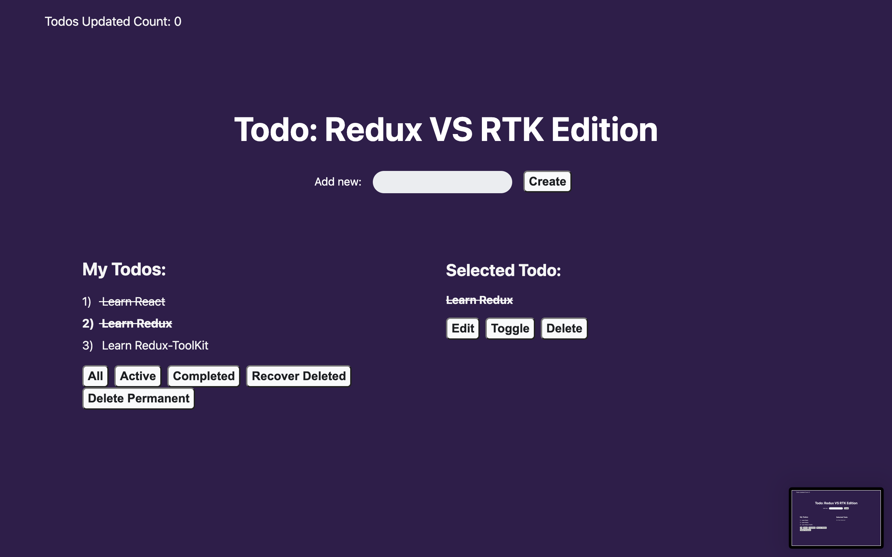

This is the starting place in conjunction with my **Redux Toolkit** comparison video. Please start here. NOTE: no dependencies related to Redux are installed here! Please follow along in the video and add them with me!

## How did I create this project?

1) I created a Typescript template create-react-app project by running  
`npx create-react-app rtk --template typescript`
2) Personal Preference and purely optional, but I installed `prettier` and created the `.eslintrc.json` file to link prettier and ESLint together.
3) I installed `uuid` and `@types/uuid` to be able to generate unique IDs.
4) I removed most of the starter code that CRA gives you and created the template that you see above.

## How do I start the app??

Go to the root directly, open up the terminal, and type `npm start`
